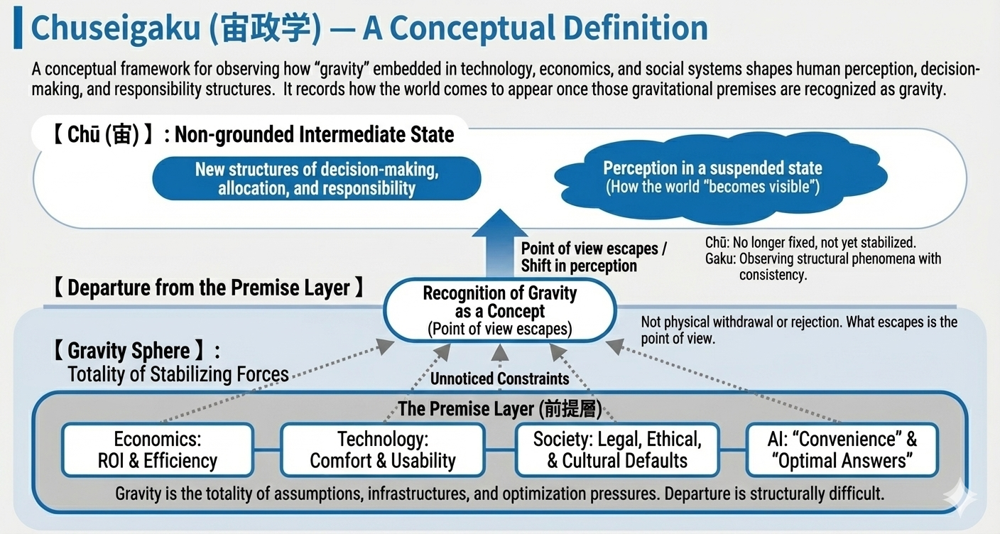

## Chuseigaku — A Conceptual Definition

> **Chuseigaku (宙政学)** is a conceptual framework for observing how “gravity” embedded in technology, economics, and social systems shapes human perception, decision-making, and structures of responsibility.
> 
> In this context, gravity does not refer to physical force, but to the often-unnoticed assumptions, incentives, infrastructures, interfaces, and optimization pressures that continuously pull individuals and societies back toward particular modes of judgment and behavior.
> 
> Chuseigaku (宙政学) is not a theory of reform, a political ideology, or a predictive model.  
> **It records how the world comes to appear once those gravitational premises are recognized as gravity.**

---

## Gravity as a Concept

> Within Chuseigaku (宙政学), gravity denotes the totality of forces that stabilize perception:
> 
> - ROI and efficiency metrics in economics
>     
> - Comfort and usability norms in technology
>     
> - Legal, ethical, and cultural defaults in society
>     
> - “Convenience” and “optimal answers” in AI systems
>     
> 
> These forces are **not chains**.  
> Yet **departure from them is structurally difficult**.
> 
> This condition is referred to as the **gravitational sphere**.

---

## “Atmospheric Escape” as a Metaphor of Perceptual Shift

> When gravity is understood as a concept rather than a given, perception undergoes what Chuseigaku (宙政学) metaphorically calls **atmospheric escape**.
> 
> Atmospheric escape does not require physical withdrawal from society, rejection of technology, or ideological opposition.
> 
> **What escapes is not the body, but the point of view.**
> 
> From this position, existing systems are no longer experienced as neutral realities,  
> but as contingent structures with specific trade-offs, speeds, and logics of allocation.
> 
> In later formulations of Chuseigaku,  
> this perceptual shift is described more precisely as a **departure from the premise layer**—  
> the state in which the assumptions composing the gravitational sphere become relativized,  
> and distance from inherited orbits begins to emerge.

---

## Why “Chusei” (宙)

> The term _chusei_ (宙) does not signify outer space or transcendence.
> 
> It refers instead to a **non-grounded intermediate state**—  
> no longer fixed to the surface of inherited assumptions,  
> yet not stabilized into a new doctrine or system.
> 
> Chuseigaku (宙政学) describes perception as it exists in this **suspended state**.

---

## Why “Gaku” (学)

> Chuseigaku (宙政学) is called a _gaku_ (学) not because it claims academic authority,  
> but because it seeks to **observe, name, and record** structural phenomena with internal consistency.
> 
> It does not instruct action.  
> It does not demand belief.
> 
> **It records how decision-making, allocation, and responsibility come to appear**  
> once gravitational premises lose their sense of inevitability.

---

## Appendix: The Premise Layer (前提層)

> In later formulations of Chuseigaku, the term **Premise Layer** is introduced to clarify the structure of gravity at the level of cognition.
> 
> The Premise Layer refers to the stratified set of assumptions, defaults, and implicit constraints that precede conscious judgment.  
> These premises are not typically experienced as propositions or beliefs, but as the _background conditions_ that make certain questions, options, and decisions appear natural, efficient, or inevitable.
> 
> The Premise Layer includes, but is not limited to:
> 
> - What is considered a “reasonable” decision
>     
> - Which trade-offs are rendered invisible by optimization
>     
> - Which forms of responsibility are assumed rather than chosen
>     
> - Which speeds, scales, or efficiencies are treated as self-evident
>     
> 
> In Chuseigaku, gravity is said to operate primarily through this Premise Layer.  
> To recognize gravity as gravity is therefore to begin perceiving the Premise Layer itself as contingent rather than given.
> 
> The term **Departure from the Premise Layer** does not indicate total escape or transcendence.  
> It names the condition in which cognition acquires distance from these premises—  
> enough to observe their effects, without necessarily abandoning the systems in which they operate.
  

---

## FAQ: Is Chuseigaku a Methodology?

> **Is Chuseigaku a methodology?**
> 
> Chuseigaku is not a methodology in the conventional sense.
> 
> It does not provide procedural steps, analytical tools, or decision rules.  
> Nor does it prescribe how observation _should_ be conducted or what conclusions _ought_ to be drawn.
> 
> Instead, Chuseigaku describes a **shift in the conditions under which observation becomes possible**.  
> It concerns how perception, judgment, and responsibility appear _after_ gravitational premises have been recognized as contingent.
> 
> In this sense, Chuseigaku is better understood as a **descriptive framework** rather than an operational method.  
> It does not optimize outcomes, improve decisions, or resolve conflicts.
> 
> What it offers is a way to **situate observation itself**—  
> to make visible the gravitational structures that silently organize what can be seen, decided, or delegated in the first place.

---

