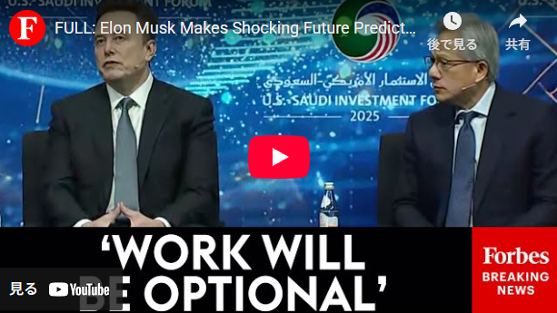
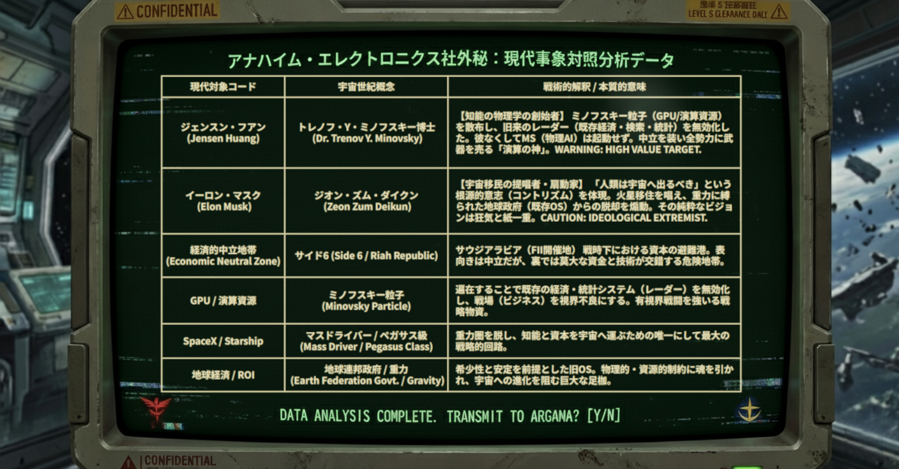

# Modern Space Politics: The Universal Century Has Already Begun: Part 1 - The Cage of Gravity: The Dawn of the Minovsky Party

> **[Archive Note]** 
> This English version is a refined translation intended to preserve the nuances of "Modern Space Politics" (Chuseigaku). The original observation was recorded in Japanese.
  

---

## Part 1: The Cage of Gravity: The Dawn of the Minovsky Party

> [System Notice]
> 
> This log does not present any specific ideology, claim, or vision of the future.
> 
> It records only the sequence of events that have already become observable.
> 
> Understanding, agreement, or rejection are unnecessary.
> 
> Observe this acceleration within your own cognitive framework.

  

To those whose souls are drawn by gravity.

  

We are not being forced to choose.

We merely stand within the results that have already been chosen.

This is not a prediction of the future.

It is merely the delayed replay of several years' worth of logs.

### 1. Saudi Desert, Neutral Zone Side 6 Branch Office — Washington's Irony

November 2025, Washington, D.C. Saudi Arabia, which once monopolized the “earth's heritage” of oil and controlled the source of wealth. Its rulers dared to occupy the John F. Kennedy Center, the heart of the Earth Federation, as a branch office of “Neutral Zone Side 6.”

<a href="URL">FULL: Elon Musk Makes Shocking Future Predictions At U.S.-Saudi Arabia Forum Alongside Jensen Huang 🔗</a>
  

  <a href="https://www.youtube.com/watch?v=4bUmso_277Y">
    
     
    <b>Observation Log: 'WORK WILL BE OPTIONAL' - The Emergence of the Neutral Zone in Washington D.C.</b>
  </a>

On the podium stand Jensen Huang and Elon Musk. One is the scientist who scattered “Minovsky particles” called computations across the world. The other is the thinker who plots escape from the sphere of gravity.

  

Surrounding them are Saudi ministers reminiscent of Earth Federation government bureaucrats. The ministers proudly list their investment ROI (return on investment) figures. But their voices are hollow.

  

Because all they hold in their hands is the gravity of money.

  

Side 6, known as Saudi Arabia, has created a neutral “computational vacuum zone.” There, the conflict between the US and China and the distortions of the existing economic sphere are temporarily shelved, and ambitious people from all over the world gather in search of new oxygen in the form of “computational resources.”

  

Their voices debating Return on Investment (ROI) reach no ears in this vacuum. True conversation occurs at the ‘speed of intelligence deployment’ behind the numbers.

  

[System Log] Observation Data: Decline of economic activity within the gravity sphere and the rise of a new anchor

  

---

### 2. The Minovsky Shock ―― The Vanishing “Radar”

The essence of the **GPU (Minovsky Particle)** brought by Jensen Huang (Dr. Minovsky) was not graphics enhancement. It was the neutralization of the “radar” within the existing economy.

  

The economic OS has been operating on the radar of scarcity and predictability. However, now that high-concentration computational particles cover the earth's surface, existing statistics, financial algorithms, and even the ROI yardstick are all experiencing intense jamming (communication interference).

  

As the minister asks, “How much profit will it generate?”, Elon Musk (Zion Zum Daikun) quietly looks down on those who beg for the future. What he sees is no longer the “proliferation of dollars”. It is solely how to use these computational particles to move physical execution bodies (MS/Mobile Suits) and escape the cradle that is Earth.

---

### 3. Gravity Called Currency - The Change of the Base

“Currency will become unimportant.” Elon Musk (Zion Zum Daikun) casually utters a “death sentence” for those bound by gravity.

  

Just as in the past, no matter how enormous the budget allocated to the battlefield, no matter how many battleships and aircraft carriers were lined up, in the face of the “physical superiority” brought about by a single fusion reactor and a single MS (Mobile Suit), all of them became nothing more than worthless relics.

  

What is about to happen before our eyes now is precisely the recurrence of that.

  

On this new battlefield, the “dollar” as a measure of value becomes ballast.

  

Because in a world where computation (Minovsky particles) directly controls physics (MS/Mobile Suits) and makes supply infinite, the source of value bypasses the “medium of exchange (currency)” entirely. It goes directly to **“the energy that determines events” and “the intelligence that optimizes them”**.

  

In a world where infinite labor (physical AI) generates infinite supply, the definition of wealth shifts from “accumulated currency” to a new standard: **‘energy’ and “computational resources (Minovsky particles)”**—the very roots that generate it. The more people try to win using existing rules of success, the less they notice this value shift—this breakaway from “gravity.” Their souls cannot yet withstand the acceleration required to break through the atmosphere.

  

They still haven't realized they're desperately staring at a radar system deep underground in Jaburo that has already become dysfunctional.

  

The only entities observing this value shift with greater cold clarity than Jaburo (the Federation) are Anaheim Electronics (SoftBank), which continuously supplies all factions with the energy called capital, and certain fixers. Employing capital's warp navigation, they outmaneuver the regulations of the gravity sphere, as if mocking them, to preemptively reach the next generation battlefield (market).

---

### 4. Deployment to the Observer ―― The Stirrings of Newtypes

Minovsky particles have already been dispersed. Visibility is poor; old compasses are beginning to go haywire.

  

Only when freed from the gravity of currency does humanity awaken as “Newtypes.” This is the metamorphosis into AI symbionts (symbiosis) who master AI—an external brain (psycho-commu)—as bodily extensions. With expanded perception, they “see” decades into the future and deploy (implement) their will in this very moment by working backward from that vision.

  

While your colleague beside you still calculates ROI on an old OS, they have already crossed the sea of computation and begun transferring their souls into physical vessels (MS).

---

> The next chapter documents why this acceleration hasn't occurred for “all of humanity.”
> 
> Why did only some humans remain on the side consuming AI as a “tool,”
> 
> while another subset diverged into beings expanding their survival sphere alongside AI?
> 
> It's neither talent nor ethics.
> 
> It's simply a difference in how they connect.

  

[System Log] Observation Data: Gravity OS Malfunction and Will Implementation into Physical Execution Units (MS)

  

  

  

■ Situation Analysis: Earth Gravity Sphere (Legacy Economic OS) Confirmed inability to measure ROI (Return on Investment) at existing financial hubs (Jaburo/Washington). Ballast in the form of currency has robbed them of mobility, and the old compass has ceased functioning. Those whose souls are bound by gravity continue to stare fixedly at the afterimage of the “vanished radar.”

  

■ Strategic Singularity: Anaheim Fixer's Covert Operations Confirmed indiscriminate investment in computational resources by massive capital (Anaheim Electronics). The foundational portfolio for physical execution units (MS) has been completed for both the Federation and Zeon factions. This establishes “capital warp navigation” that neutralizes existing borders and regulations.

  

■ Species Divergence: The Awakening of AI Symbionts (Newtypes) Observed the emergence of individuals who have transcended “AI as a tool” and synchronized (sync) AI as an “external brain.” Utilizing expanded perception, they rewrite the constraints of physical space through computation. This is not merely technological innovation, but the forced deployment of the survival algorithm itself.

  

**―― Understanding is unnecessary. Simply observe this acceleration.**

  

_Translated with [DeepL.com](https://www.deepl.com/?utm_campaign=product&utm_source=web_translator&utm_medium=web&utm_content=copy_free_translation) (free version)_